# Introduction

In 1977 NASA sent into space the famous Voyager I and II spaceprobes. A message to any future alien species that could find the probes was attached to the probes, as a golden phonographic disk containing samples of sounds of planet Earth, including greetings, music and a collection of images depicting many aspects of the Earth existence. 

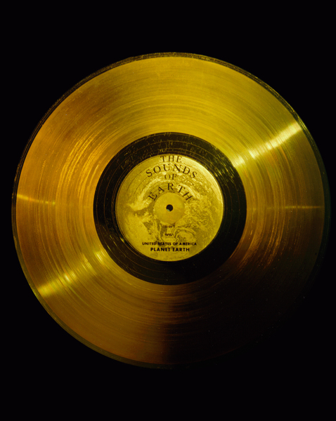

Being the disks carriers of sound, the images had to be encoded in an audio signal, in the shape of soundwaves representing consecutive scanlines of the images, in a similar fashion that the method used to broadcast TV.

Recently, a team leaded by David Pescovitz gained access to the original master tapes used by NASA to create the message, and started a campain to crowd fund a [remastered new edition of the Golden Record](http://www.ozmarecords.com). Thanks to the kind help of Mr. Pescovitz, I was able to examine a high quality copy of the images audio signal, a 32-bit .wav file digitized at sample rate of 384kHz. The current program is a simple tool I created to examine the images encoded in the audio signals.

# Theory of operation

In order to decode the images, the graphic instructions of the Golden Disk cover should be enough to begin with. In them, indications are provided indicating the analog nature of the recording, the way of how the disk must be played, the general layout of the audio signal representing consecutive scanlines of an image, the number of scanlines constituing an image, and the appearance of a calibration image (a circle), which would indicate that the signal is correctly decoded. 

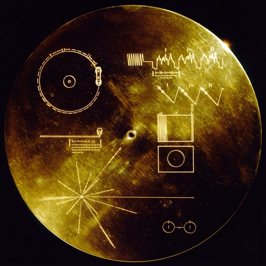

Looking at the instructions on the cover, the wave shapes are the first clue of the nature of the data: 

So, according this, the signal seems to be composed by consecutive packages of data where, presumingly, the amplitude of the weave peaks of each package represent the encoded infomation of the record. The binary values above each package suggest indicate an order of appearance to each package.

Looking further in the plate, more information is provided:

A layout suggesting that apparently, an image is build up from of many of these consecutive packages, stacked one after the other. The layout show at the end of the image the binary value 1000000000, which translates to 512 in decimal. This suggests that an image is composed by 512 packages of data. The figure of the circle indicates that such image should appear if the reading process is done properly.

How to read the data contained in the audio files? Capturing the audio signal and decode their images perhaps was, back in the 70s, a more complicated task that could involve the construction of custom hardware that could capture, filter (analyse) and visualize the data. Nowadays, we do live, fortunately, in a golden era of data processing, for which there exists a lot of free tools that allow us its manipulation and analysis. The process of digitizing of the master tape can be easily done in any computer with a decent sound card, besides, the analysis and visualization of the captured data, is practically a trivial task. 

It is factor of good chance that, in our case, the audio signal is already digitized from the master tapes, which saves us the process of having to 
figuring out from the cover instructions the correct procedure to play the disk. Notice that in the Golden Disk design, instructions and hardware - a phonograph stylus- were provided to the extraterrestrials in order to play the disk. However, the task of transfering the disk's signal into a more suitable medium for analysis was left to the alien's technology.

In order to save space, NASA decided to take advantage of the stereo sound of the phonographic recording, to include two separate audio signals, splitted in the right and left channels of the audio. This means that playing the audio file, *two* images are being "played" at the same time. Unfortunately for the extraterrestrials, the existece of these two signals in the phonographic track is not explicity explained in the cover's instructions which instead suggest the existence of a monophonic signal only. Unless the aliens do not figure out how the earthlings managed to [record a stereo signal in a one-track phonographic record](https://en.wikipedia.org/wiki/Phonograph_record#Stereophonic_sound) , they will face the risk to retrieve a mixed, monophonic version of the images signal. As said before, our digital audio file waive us from this problem, as it provides the two stereo channels already separated, as it was taken directly from the original master tape. 

So out first analysis tool, is any decent audio editing software - in my case I used [Audacity](http://www.audacityteam.org)-. Using this software,the stereo channels can be splitted into two monophonic files, still preserving the same sampling quality.

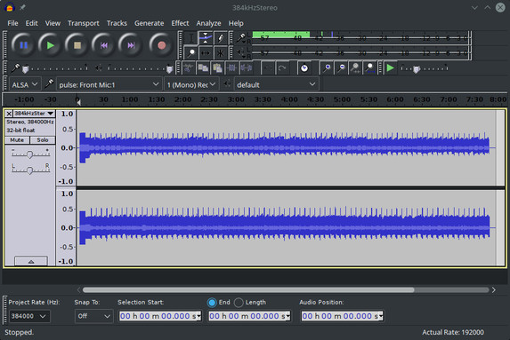

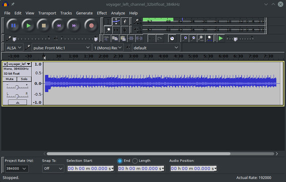

Albeit Audacity can show in screen a visual representation of the signal, it is better to appeal to especifically designed tools for data visualizing. Here, the Python language shines due to its simplicity of use and the lot of data analysis libraries it contains. A first task to achieve with Python is to access the contents of the [PCM data](https://en.wikipedia.org/wiki/Pulse-code_modulation) within the monophonic .wav files. This is easily done using the [Scipy](https://www.scipy.org/scipylib/index.html) package:

    import scipy.io.wavfile
    rate, data = scipy.io.wavfile.read('voyager_left_channel_32bitfloat_384kHz.wav')

This will create two variables: `rate` will contain the sample rate: 384000, and `data` will be an [numpy](http://www.numpy.org) array containing the consecutive 32bit, signed values for all the samples of the signal. 

Visualizing the data is also straightforward by using the [Matplotlib](https://matplotlib.org) package. For example, in order to plot the first 10000 samples of the signal we can make:

    import matplotlib.pyplot as plt
    offset = 0
    chunk = data[offset:offset+10000]
    plt.plot(range(len(chunk)), chunk)
    plt.ylim([-0.2, 0.2])
    plt.xlabel("Sample offset")
    plt.ylabel("Sample value")  
    plt.show()

This yields this plot:

Seems nothing! In fact it seems the natural background very low noise of the beggining of the unrecorded tape. However, around the sample number 1412377 (about 3.67 seconds) the signal shows up:

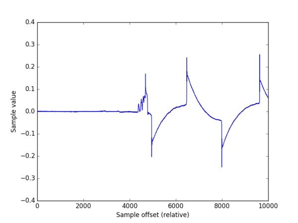

Seems interesting. At the offset 5997775 (15.6 sec) we can see a series of pulses similar to the one indicated in the cover instructions (figure 5):

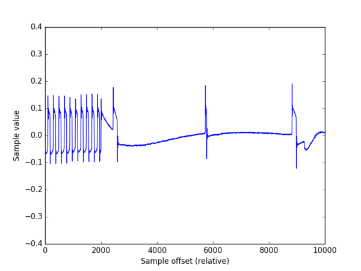 

At offset 6227756 (16.2 sec) the signal shape get more stable:

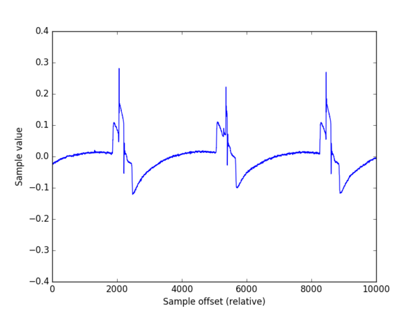

However, the sections of the signal that whould carry the image information seem flat.  Do they represent, perhaps, parts of the image with no color? Looking further, at the offset 6461137 (16.8 sec) we see that, effectively, two pulses appear in the signal, indicating the presence of "pixels":

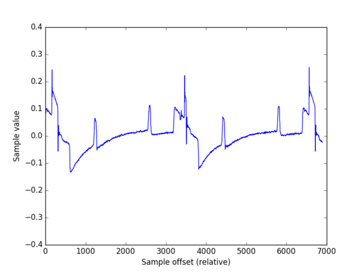

Comparing, however, the signal layout with that of the cover instructions, it seems that in the cover, the sign of the y-axis is inverted, as the big pulses (those who take a value higher than 0.2) should make part of the "square" pulses sections that, according the cover should take a negative value. Change the sign to the retrieved data is straightforward:

    chunk = -data[offset:offset+10000]

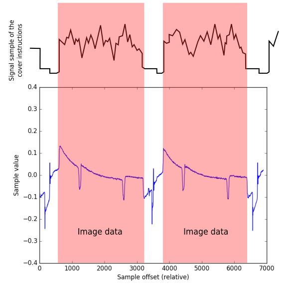

Figure 9 shows how changing the sign, the retrieved signal and the cover image seem to match. Could this be a misleading clue to the extraterrestrials? May be not. Remember that, representing the positive axis in the up direction is just a human convention, doing it in the opposite way is equally correct, from a mathematical point of view. However, is annonyng that the cover does not indicate what is *our* way of representation. The aliens will face the ambiguity to decode two versions of the color of a pixel: is white, or is it black?

A visual inspection of figure 9 suggest that the "scan width line" (SWL) of an image corresponds to a value approximated to 3200 samples. How to display an entire image? First we can build a python array containing 512 consecutive lines of 3200 samples each one:   

    image_data = []
    offset = 6000000
    scan_width = 3200
    for scan in range(512):
        image_data.append(data[offset:offset+scan_width])
        offset += scan_width

Visualizing the contents of the 2D array as an image is done thanks to Matplotlib's magic:

    plt.imshow(image_data)
    plt.show()

which yields:

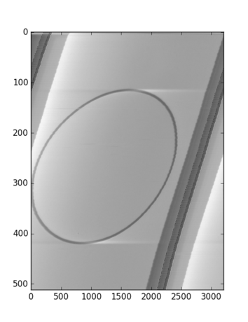

Bingo! Our first image appears in the screen: the calibration circle described in the cover (just imagine the extraterrestrials' excitement!) However, the image is not entirely aligned, which suggest that we must calibrate the value for SLW. Playing a bit, this the displayed image with values for SLW of 3196, 3197, and 3198 respectively:

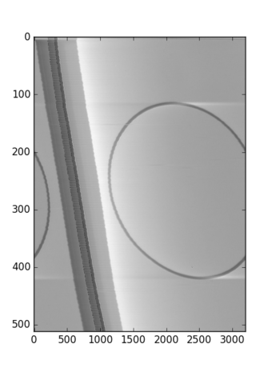
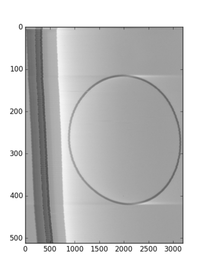
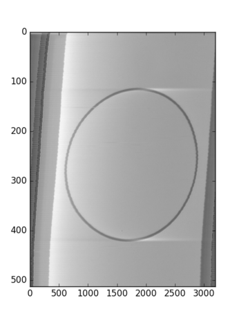

3197 seems to be the best aligment, however it is not the most perfect one, which means that the correct value for SLW lies between 3197 and 3198, which poses a problem as by nature, the value of SLW should be an integer value. Instead of writing a sofisticated algorithm to detect and align each line scan,  a poor's man approach could introduce a correction factor that would help to align "in average" the image:

    image_data = []
    offset = 6000000
    scan_width = 3197
    adjust_offset = 0.4
    for scan in range(512):
        image_data.append(data[int(offset):int(offset)+scan_width])
        offset += scan_width + adjust_offset

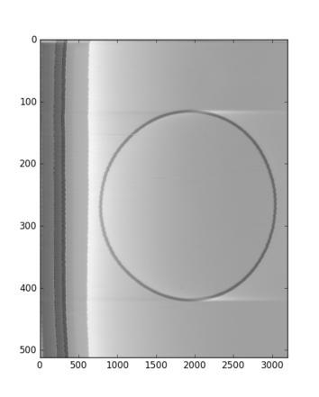

Albeit it is not a perfect result, it is quite acceptable. Unfortunately, it seems that the analog equipment used to encode the images was not entirely precise, as the `adjust_offset` varies from image to image, for example, the iconic image:

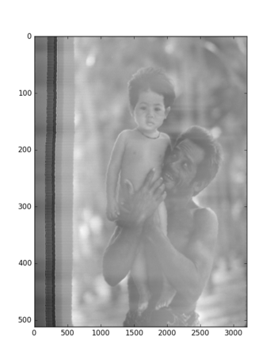

needs an `adjust_offset: -1.9` , its other parameters are `offset: 104178442` , `scan_width: 3197` and `SLW: 512`

In summary, the key to access an image is first to find its location in the audio file (offset), and from there extract a given number of audio samples which are reorganized in a 2D matrix, which is then displayed as an image.
 
# The Browser

In order to make easy this exercise of image decoding, I have written a small Python3 utility called `voyagerimb.py`, which implements the method described above. 

## Requirements

The following Python3 packages are needed in order to run `voyagerimb.py`:

* Pillow==3.1.1
* numpy==1.10.4
* scipy==0.17.0
* matplotlib==1.5.1

These can be installed using the command `pip install`. Some packages, however, require to compile C code during the installation, which might be troublesome in some platforms. I strongly recommend to use the [Anaconda Python3 distribution](https://www.anaconda.com), which comes with all the dependencies ready to use. 

## Usage

In order to launch the utility just type:

    $HOME/anaconda3/bin/python voyagerimb.py

This window should appear:

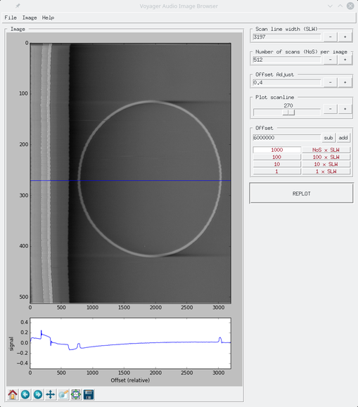

### description of the menus:

#### File -> Open Wav...

Allows to read an audio .wav file (one channel - mono) into memory

#### File -> Export image...

Exports the displayed image using a ratio 3:4. The width of the image equals to SLW, the height (NoS) is rescaled.

#### File -> Export image (raw size)

Exports the displayed image with a size SLW x NoS .

#### Image -> Invert audio signal 

Changes the sign of the audio data in order to get a "positive" image

#### Image -> Flip horizontal

Inverts the direction of x-axis

#### Help -> About

Redirects the default web browser to this document

### Input boxes

Following the previous discussion, the boxes **Scan line width (SLW)**, **Number of scans (NoS) per image**,  **Offset Adjust** are self explanatory. 

#### Plot scanline

Below the decoded image, the browser displays the signal of the scan line indicated by the blue line. The box presents the user a slider in the range 0 to NoS which allows to set the location in the y-axis of the desired scanline. Press the button **REPLOT** to refresh the image.

#### Offset

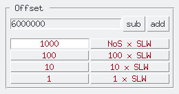

This box deserves a more detailed explanation. As discussed before, the offset describes the location in the audio file where to start to read samples to decode the image. The numerical entry holds this value. The other buttons are designed to jump forward (**add**) or backward (**sub**) along the audio data in "convenient" intervals:

- 1 sample
- 10 samples
- 100 samples
- 1000 samples
- 1 x SLW : An interval of one *Scan Line Width*  
- 10 x SLW : Ten intervals of *Scan Line Width*s
- 100 x SLW : One hundred intervals of *Scan Line Width*s
- NoS x SLW : Jump an interval of an image

just press the button of the desired interval and experiment with the **sub** and **add** buttons. The image is replotted after any button press. By playing with these parameter it is relatively easy to explore and discover the images encoded in the audio files. 

#### Matplotlib controls

In the bottom of the image, the standard Matplolib buttons are included. These allow operations as pan, zoom in/out, save plots, etc. Use them as needed. 

## TODOs

The functionality of the browser is very simple, but sufficient. Eventually, in the future I may add the posibility to save the image coordinates in *.json* files. 

The code must be documented! 

## Bugs

There should be many! So far I have tested the browser in Linux and Windows, MacOS must be tested, but I suppose it should run, as the python script uses Tkinter, which should be available in any platform. If you encounter an issue/fix, feel free to send a push request! 

